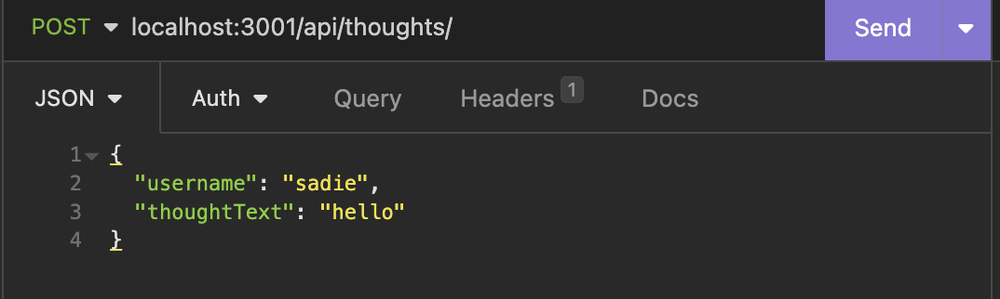

# Social Network Api

## **Description**

This application is the back-end of a social networking site. It contains routes that allow users to add and delete friends, post thoughts and reactions, and delete thoughts and reactions.

>### To watch a demonstration video on how to use the api using Insomnia, click [here](https://drive.google.com/file/d/1ePayXQWRzLWC1_ZQkNHdBw2txjtLkfWs/view)

## **Installation**

Express.js, MongoDB, and Mongoose ODM.

## **Usage**

To invoke the application, run npm start. Once api server is up and running, the routes can be tested using insomnia. 

Be sure to have all the dependencies installed properly 

Here is an example of how to create a user in Insomnia: 